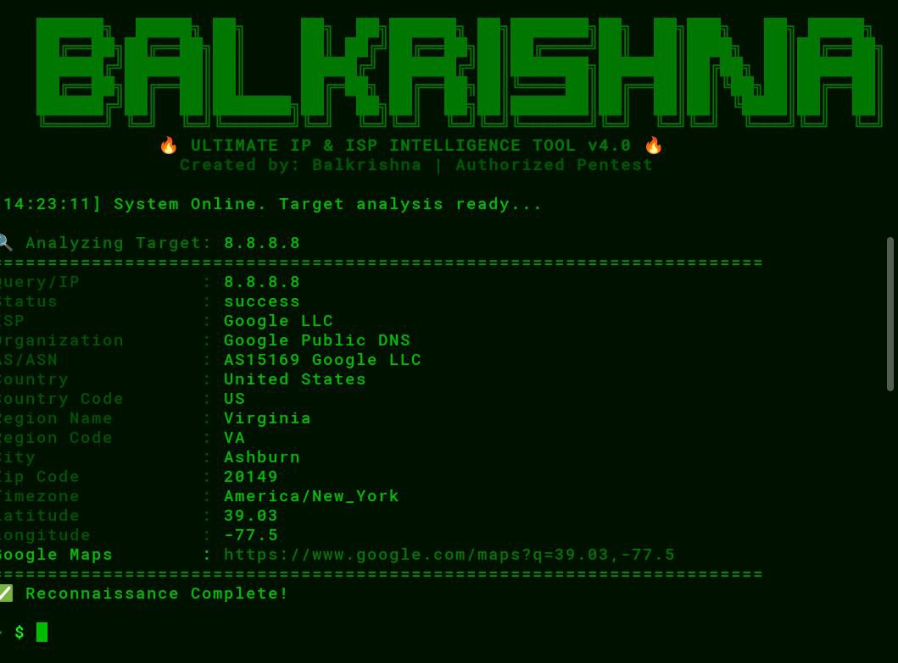
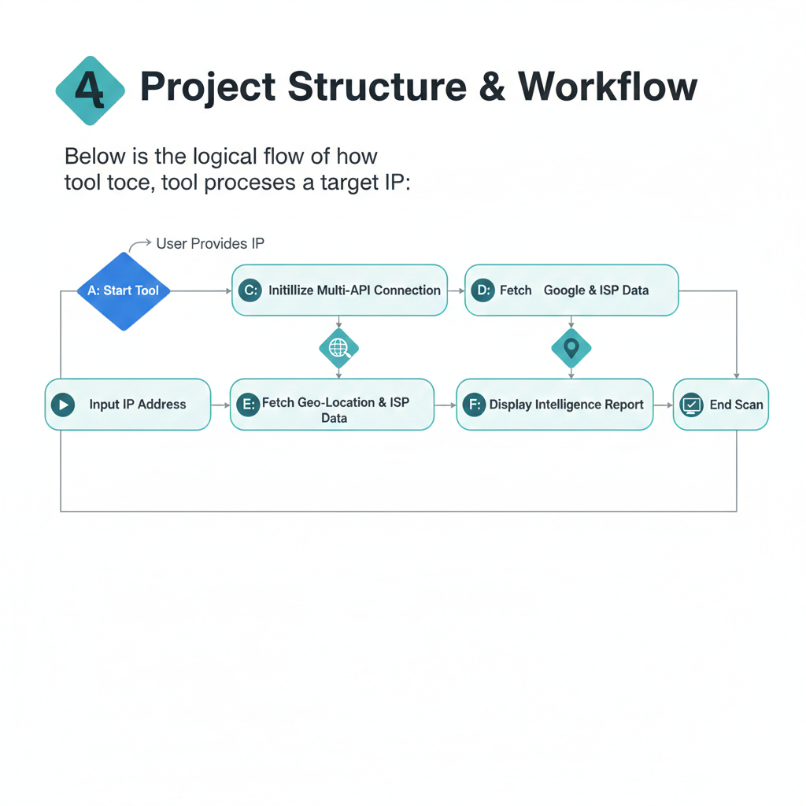

# 🛡️ Balkrishna ISP Finder v4.0
> **The Ultimate IP Intelligence & ISP Reconnaissance Tool for Professionals.**


---

## 📸 Tool Preview



---
## 📊 Project Structure & Workflow


---

## 4. Workflow Visual (Vertical Step-by-Step)
For a clean vertical look, your workflow should look like this on the page:

1.  **Start**: Launch the Python script.
2.  **Input**: Enter the Target IP.
3.  **Process**: API fetches data from the cloud.
4.  **Result**: Full ISP details displayed.
5.  **Finish**: Scan completes.

---

## 💎 Key Features 
Full Intelligence: Fetches AS, Country, City, ISP, Org, and Zip.
Coordinate Precision: Provides exact Latitude and Longitude.
Visual Mapping: Generates a direct Google Maps link.
Optimized UI: Stylish ASCII Art and color-coded results for Termux/Linux.

---

### 📥 Installation & Usage

#### 📱 For Termux (Android)
```bash
pkg update && pkg upgrade -y
pkg install python git -y
git clone [https://github.com/bkshukla91/balkrishna-isp-finder.git](https://github.com/bkshukla91/balkrishna-isp-finder.git)
cd balkrishna-isp-finder
pip install -r requirements.txt
python balkrishna_isp.py

#### 💻 For Linux (Ubuntu/Kali/Debian)
```bash
sudo apt update && sudo apt upgrade -y
sudo apt install python3 python3-pip git -y
git clone https://github.com/bkshukla91/balkrishna-isp-finder.git
cd balkrishna-isp-finder
pip3 install -r requirements.txt
python3 balkrishna_isp.py

---

## 📜 License
This project is licensed under the MIT License. See the LICENSE file for details.

## ⚖️ Disclaimer
This tool is for Educational Purposes and Authorized Pentesting only. The author is not responsible for any misuse.
